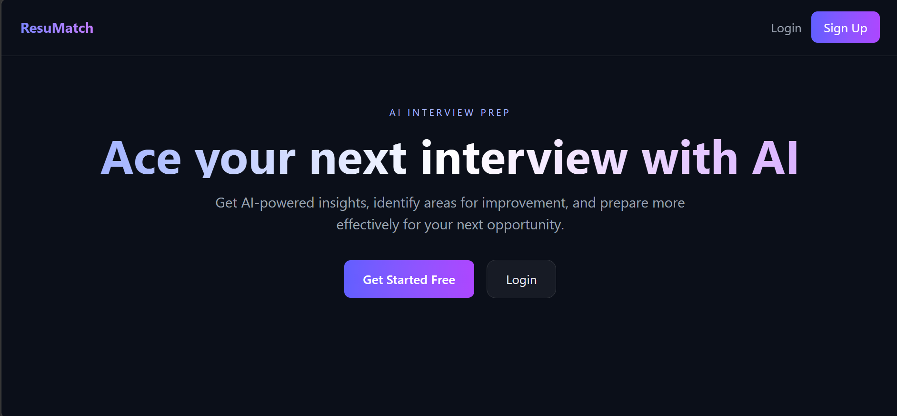
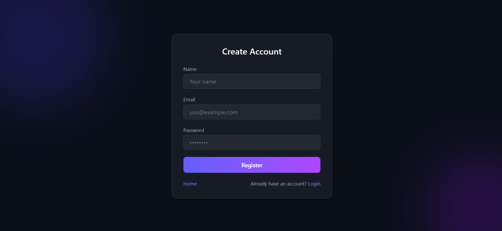
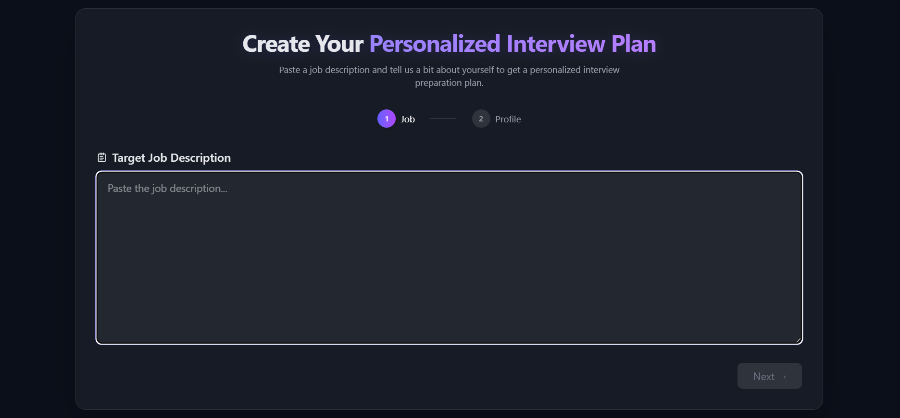
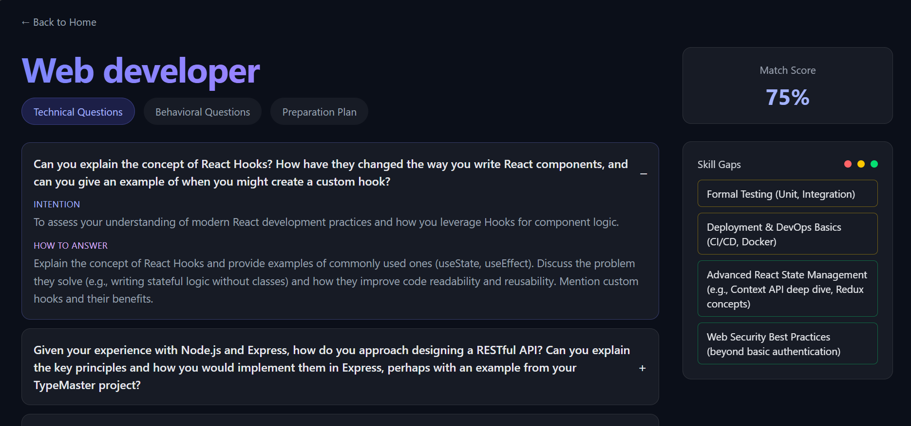

# ResuMatch 🎯

An AI-powered interview preparation platform that analyzes your resume or profile against a job description and generates personalized interview questions, skill gap analysis, and a day-by-day preparation roadmap.

## 🔗 Live Demo
[resumatch-18.vercel.app](https://resumatch-18.vercel.app)

## 📸 Screenshots

## ✨ Features

- Upload resume (PDF) or write a self description
- AI-powered skill gap analysis based on job description
- Personalized technical & behavioral interview questions
- Day-by-day preparation plan tailored to your gaps
- Match score showing how well you fit the role
- Save and manage multiple interview reports
- Delete reports you no longer need
- JWT authentication with token blacklisting for secure logout

## 🛠️ Tech Stack

| Layer | Technology |
|-------|------------|
| Frontend | React.js, Tailwind CSS, Framer Motion |
| Backend | Node.js, Express.js |
| Database | MongoDB, Mongoose |
| Authentication | JWT + Token Blacklisting |
| AI | Google Gemini API |
| File Handling | Multer, pdf-parse |
| Deployment | Vercel (frontend), Render (backend) |

## 🤖 How It Works

1. **Upload Your Profile** — Upload your resume as a PDF or write a short description about yourself
2. **Paste Job Description** — Add the job description of the role you're targeting
3. **AI Analysis** — Gemini AI compares your profile against the job requirements
4. **Get Your Report** — Receive skill gaps, interview questions, and a preparation plan

## 🔒 Environment Variables

**Backend:**

| Variable | Description |
|----------|-------------|
| MONGODB_URI | MongoDB Atlas connection string |
| JWT_SECRET | Secret key for JWT signing |
| GOOGLE_GENAI_API_KEY | Google Gemini API key |
| FRONTEND_URL | Frontend URL for CORS |

**Frontend:**

| Variable | Description |
|----------|-------------|
| VITE_API_URL | Backend URL for API calls |

---

Built with ❤️ using React, Node.js, MongoDB and Gemini AI